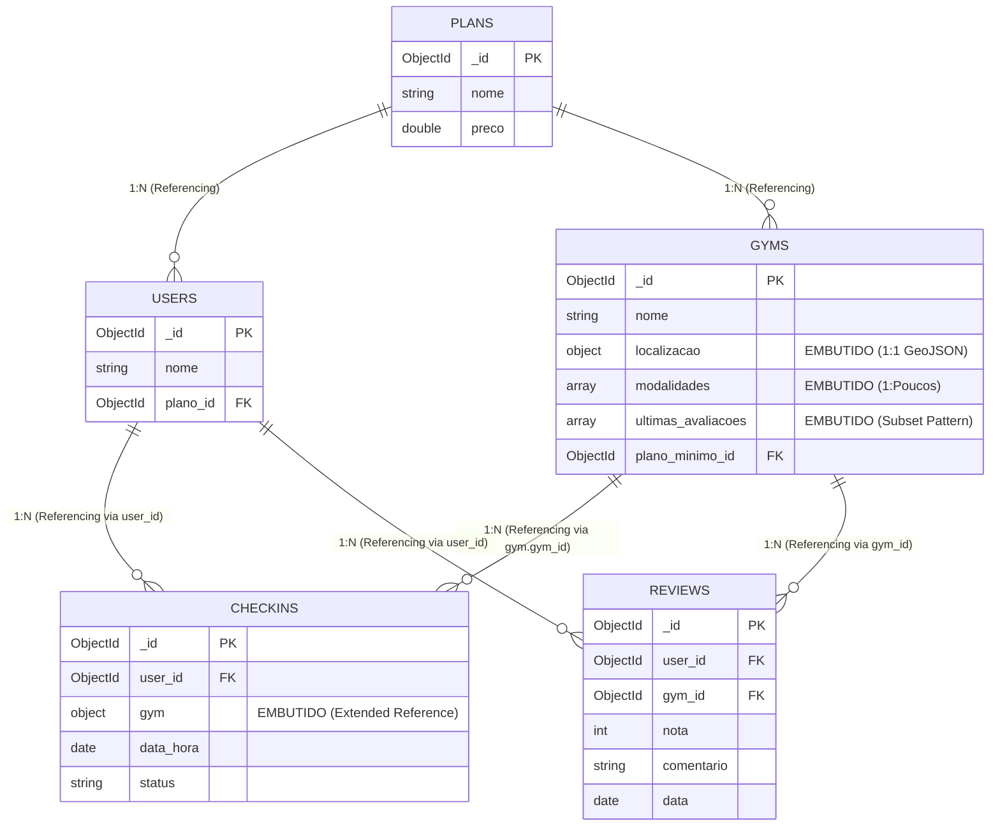

# Checkpoint 1 — Treinna (App de Check-in em Academias)
**Disciplina:** Banco de Dados NoSQL (TSI34E-TSI4) — UTFPR Campus Guarapuava  
**Professor:** Prof. Marcelo Vichar  
**Alunos:** Ana Clara Novak, Eduardo de Almeida Fernandes, Matheus Lorenzo Siqueira  
**Data:** 20/09/2026

---

## 1. Tema e Escopo do Sistema

O **Treinna** é uma plataforma de bem-estar e acesso flexível a academias, operando em um modelo de assinatura unificada (estilo Wellhub/Gympass). O sistema conecta dois perfis principais: **alunos** (que buscam locais de treino próximos, comparam avaliações e realizam check-ins via GPS) e **academias parceiras** (que gerenciam suas modalidades, planos aceitos e validam os acessos recebidos). 

O problema central que o sistema resolve é a barreira geográfica e financeira da fidelidade a uma única academia, além de combater a ociosidade dos estabelecimentos em horários de menor movimento. 

A escolha de um **banco de dados NoSQL (MongoDB)** é justificada por dois pilares técnicos críticos do negócio:
1. **Buscas Geoespaciais Nativas:** A funcionalidade primária do app exige cálculos matemáticos contínuos de proximidade (ex: "Academias num raio de 5km da latitude/longitude X"). O MongoDB resolve isso nativamente com índices `2dsphere` e operadores `$near`.
2. **Alta Performance de Leitura (Query-Driven):** Em horários de pico (ex: 18h às 20h), milhares de usuários abrem o app simultaneamente para ver o histórico e fazer check-in. Usando modelagem orientada a documentos e *Extended Reference*, conseguimos carregar o histórico de treinos com leitura atômica, eliminando os pesados `JOINs` relacionais.

---

## 2. Entidades e Coleções

O sistema foi modelado com **5 coleções principais**, utilizando fortemente subdocumentos e arrays com tipos BSON estritos:

### 2.1. Coleção `gyms` (Academias)
Entidade central com os dados estruturais e de localização.
* `_id`: ObjectId — Identificador único.
* `nome`: String — Nome fantasia da academia.
* `ativo`: Boolean — Indica se a academia está aceitando check-ins.
* `mensalidade_base`: Number (Double) — Valor base de repasse.
* `plano_minimo_id`: ObjectId — Referência à coleção `plans`.
* `localizacao`: Subdocumento (Objeto) — Embutido:
  * `rua`: String
  * `cidade`: String
  * `coordenadas`: Array [Longitude, Latitude] — (Padrão GeoJSON Point)
* `modalidades`: Array de Strings — Ex: `["Musculação", "Crossfit"]`.
* `ultimas_avaliacoes`: Array de Subdocumentos — Snapshot para exibição rápida na listagem (Subset Pattern).

### 2.2. Coleção `users` (Alunos)
Perfil do usuário consumidor.
* `_id`: ObjectId
* `nome`: String
* `email`: String
* `telefone`: String
* `plano_id`: ObjectId — Referência ao plano contratado.
* `data_cadastro`: Date (ISODate)

### 2.3. Coleção `checkins`
Histórico imutável de acessos e treinos realizados.
* `_id`: ObjectId
* `user_id`: ObjectId — Referência ao aluno.
* `gym`: Subdocumento (Objeto) — Snapshot (Extended Reference):
  * `gym_id`: ObjectId
  * `nome`: String — Nome da academia no momento do check-in.
* `data_hora`: Date (ISODate)
* `status`: String — `"validado"`, `"pendente"`, `"cancelado"`.

### 2.4. Coleção `plans`
Catálogo mestre de planos (Basic, Silver, Gold).
* `_id`: ObjectId
* `nome`: String
* `preco`: Number (Double)
* `beneficios`: Array de Strings

### 2.5. Coleção `reviews`
Armazena todo o histórico de avaliações que não couberam no Subset da academia.
* `_id`: ObjectId
* `user_id`: ObjectId
* `gym_id`: ObjectId
* `nota`: Number (Int) — de 1 a 5.
* `comentario`: String
* `data`: Date (ISODate)

---

## 3. Modelagem: Embedding (Embutir) vs. Referencing (Referenciar) 

| Relacionamento | Decisão Adotada | Justificativa Técnica & Trade-Offs |
| :--- | :---: | :--- |
| **Academia $\rightarrow$ Localização** | **Embedding** *(Subdocumento)* | **Relação 1:1 estrita.** A localização pertence exclusivamente à academia e deve ser lida 100% das vezes na renderização do mapa. Embutir permite criar o índice `2dsphere` para buscas geoespaciais e evita JOINs em consultas pesadas. |
| **Academia $\rightarrow$ Modalidades** | **Embedding** *(Array)* | **Relação 1:Poucos limitados.** Uma academia tem poucas modalidades (5 a 10). Embutir evita criar tabelas associativas N:N, mantendo o documento pequeno e a leitura atômica. |
| **Academia $\rightarrow$ Avaliações** | **Híbrido** *(Subset Pattern)* | **Prevenção de Unbounded Arrays (16MB Limit).** As avaliações crescem para sempre. Embutimos apenas as 2 `ultimas_avaliacoes` no documento da academia para a tela inicial. O histórico completo virou referência na coleção externa `reviews`. |
| **Aluno $\rightarrow$ Plano** | **Referencing** *(ObjectId)* | **Catálogo Compartilhado.** Os planos têm ciclo de vida independente (seus preços mudam para todos). Salvar apenas o `plano_id` garante que milhares de usuários apontem para a mesma regra de negócio. |
| **Check-in $\rightarrow$ Academia** | **Embedding** *(Snapshot Histórico)* | **Imutabilidade e Otimização de Leitura (Extended Reference).** Em vez de referenciar apenas o `_id` da academia, nós embutimos uma cópia do `nome` dentro do check-in. Isso garante que a tela de histórico do usuário não exija comandos `$lookup` (JOIN) na coleção de academias, garantindo performance de leitura extrema. |

---

## 4. Relacionamentos e Cardinalidade



---

## 5. Exemplos de Documentos JSON

### 5.1. Coleção: `gyms`
```json
{
  "_id": { "$oid": "75b2c3d4e5f6g7a8b9c0d1e2" },
  "nome": "Uplay Guarapuava",
  "ativo": true,
  "mensalidade_base": 120.50,
  "plano_minimo_id": { "$oid": "64009f1a2b3c4d5e6f7a8b99" },
  "localizacao": {
    "rua": "Av. Manoel Ribas, 1000",
    "cidade": "Guarapuava",
    "coordenadas": [-51.4628, -25.3953] 
  },
  "modalidades": ["Musculação", "Crossfit", "Muay Thai"],
  "ultimas_avaliacoes": [
    { "nota": 5, "comentario": "Ótima estrutura." },
    { "nota": 4, "comentario": "Muito cheia às 18h." }
  ]
}
```

### 5.2. Coleção: `users`
```json
{
  "_id": { "$oid": "64a1b2c3d4e5f6g7h8i9j0k1" },
  "nome": "Eduardo Fernandes",
  "email": "eduardo@email.com",
  "telefone": "42999990000",
  "plano_id": { "$oid": "64009f1a2b3c4d5e6f7a8b99" },
  "data_cadastro": { "$date": "2026-09-01T10:00:00Z" }
}
```

### 5.3. Coleção: `checkins` (Extended Reference)
```json
{
  "_id": { "$oid": "86c3d4e5f6g7h8i9j0k1l2m3" },
  "user_id": { "$oid": "64a1b2c3d4e5f6g7h8i9j0k1" },
  "gym": {
    "gym_id": { "$oid": "75b2c3d4e5f6g7a8b9c0d1e2" },
    "nome": "Uplay Guarapuava" 
  },
  "data_hora": { "$date": "2026-09-15T18:30:00Z" },
  "status": "validado"
}
```

### 5.4. Coleção: `plans`
```json
{
  "_id": { "$oid": "64009f1a2b3c4d5e6f7a8b99" },
  "nome": "Gold",
  "preco": 149.90,
  "beneficios": ["Acesso a todas as academias parceiras", "Check-in diário", "Sem taxa de adesão"]
}
```

### 5.5. Coleção: `reviews`
```json
{
  "_id": { "$oid": "99c3d4e5f6g7h8i9j0k1l2m4" },
  "user_id": { "$oid": "64a1b2c3d4e5f6g7h8i9j0k1" },
  "gym_id": { "$oid": "75b2c3d4e5f6g7a8b9c0d1e2" },
  "nota": 5,
  "comentario": "Estrutura excelente, equipamentos novos e atendimento nota 10.",
  "data": { "$date": "2026-09-10T20:15:00Z" }
}
```

---

## 6. Relatórios e Indicadores de Negócio na Aplicação

As consultas que dão vida ao aplicativo estão mapeadas na API REST (em Node.js/Express) acessando o MongoDB nativamente através da pasta `app/src/controllers/`:

| # | Relatório / Caso de Uso | Endpoint na API | Controller Responsável | Operadores & Padrão MongoDB |
| :-: | :--- | :--- | :--- | :--- |
| **1** | **Academias Próximas (Radar)** | `GET /api/gyms/near` | `GymsController.listarProximas` | Operador Geoespacial nativo `$near` usando `$geometry` e cálculo de distância em metros. |
| **2** | **Histórico de Check-ins do Aluno** | `GET /api/checkins/user/:id` | `CheckinsController.historicoUsuario` | Leitura simples com `.sort({ data_hora: -1 })`. Otimizada pois evita `$lookup` (Extended Reference). |
| **3** | **Busca de Academias por Modalidade**| `GET /api/gyms/search` | `GymsController.buscarModalidade` | Filtro de arrays embutidos combinando `$in` (modalidade) e `{ ativo: true }`. |
| **4** | **Validar Entrada na Catraca** | `PATCH /api/checkins/:id/validar` | `CheckinsController.validarAcesso` | Operação atômica `.updateOne()` com `$set: { status: "validado" }`. |
| **5** | **Upgrade de Plano do Aluno** | `PATCH /api/users/:id/plano` | `UsersController.atualizarPlano` | Modificação de relacionamento referencial (`plano_id`) via `$set`. |

---

### Detalhamento das Consultas nos Controllers

#### 1. Academias Próximas (Radar) (`GET /api/gyms/near`)
* **Arquivo:** `app/src/controllers/gyms.controller.ts`
* **Implementação no Controller:**
```typescript
const col = getCollection("gyms");
const { lng, lat, distanciaMetros } = req.query;

const academias = await col.find({
  ativo: true,
  localizacao: {
    $near: {
      $geometry: {
        type: "Point",
        coordinates: [Number(lng), Number(lat)]
      },
      $maxDistance: Number(distanciaMetros)
    }
  }
}).toArray();
```

#### 2. Histórico de Check-ins do Aluno (`GET /api/checkins/user/:id`)
* **Arquivo:** `app/src/controllers/checkins.controller.ts`
* **Implementação no Controller:**
```typescript
const col = getCollection("checkins");
const checkins = await col
  .find({ user_id: new ObjectId(req.params.id) })
  .sort({ data_hora: -1 })
  .toArray();
```

#### 3. Busca de Academias por Modalidade (`GET /api/gyms/search`)
* **Arquivo:** `app/src/controllers/gyms.controller.ts`
* **Implementação no Controller:**
```typescript
const col = getCollection("gyms");
const { modalidade } = req.query;

const academias = await col
  .find({ ativo: true, modalidades: { $in: [modalidade] } })
  .sort({ mensalidade_base: 1 })
  .toArray();
```

#### 4. Validar Entrada na Catraca (`PATCH /api/checkins/:id/validar`)
* **Arquivo:** `app/src/controllers/checkins.controller.ts`
* **Implementação no Controller:**
```typescript
const col = getCollection("checkins");
await col.updateOne(
  { _id: new ObjectId(req.params.id) },
  { $set: { status: "validado" } }
);
```

#### 5. Upgrade de Plano do Aluno (`PATCH /api/users/:id/plano`)
* **Arquivo:** `app/src/controllers/users.controller.ts`
* **Implementação no Controller:**
```typescript
const col = getCollection("users");
await col.updateOne(
  { _id: new ObjectId(req.params.id) },
  { $set: { plano_id: new ObjectId(req.body.novoPlanoId) } }
);
```